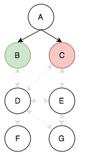

# Potato Protocol v2.1

PROPOSAL

## Contents

* [Purpose](#purpose)
* [Terminology](#terminology)
* [Mesh Conditions](#mesh-conditions)
* [Messages](#messages)
	* [Schema](#schema)
	* [Direct Messages](#direct-messages)
	* [Broadcast Messages](#broadcast-messages)
	* [Election Messages](#election-messages)
	* [Avoiding Loops](#avoiding-loops) 
* [Elections](#elections)
	* [Direct Elections](#direct-elections)
	* [Indirect Elections](#indirect-elections)
	* [Election Request Logic](#election-request-logic)
	* [Election Voting Logic](#election-voting-logic)
	* [Abstaining](#abstaining)
	* [Election Duration](#election-duration)
	* [Indirect and Direct Election Response](#indirect-and-direct-election-response)
	* [Election Outcomes](#election-outcomes)
	* [Example](#example)
	* [Systemic Bias](#systemic-bias)
	* [Conclusion](#conclusion)


## Purpose

Potato Protocol 2.1 aims to address two problems: transmitting data across a peer-to-peer connected mesh where all clients are not aware of each other and synchronizing changes across the mesh.

Potato Protocol 2.1 uses two approaches to achieve these results: a direct/broadcast messaging system that utilizes clients to relay messages to its destination and an election system that is able to gather consensus from all clients in a mesh without needing to determine who all the clients are first.

## Terminology

* `client` - An active user running an instance of the Potato application. Each unique user may run only one instance at a time.
* `mesh` - The full population of interconnected clients.
* `peer` - A client that has a direct WebRTC connection to another client without having to go through a third client.
* `message` - A WebRTC data transmission that adheres to the specified Message Schema.
* `frame` - A representation of the visual contents of a specific client's Potato canvas at a specific point in time.

## Mesh Conditions


Under ideal conditions, the mesh will consist of clients which are all peers (directly connected to each other), shown on the left. Connections between non-A clients are not depicted.

Communication under this condition is straight-forward as any peer can transmit to its peers and reach all the clients in the mesh.

However, due to network conditions, some clients may disconnect from each other while retaining connections to other peers. As a result, it is possible that some clients are still part of the overall mesh by maintaining at least one direct connection, but are not direct peers with all clients. This is shown on the right.

Communication under this condition is less straight-forward as transmitting to each peer does not guarantee that data will reach all clients in the mesh. Furthermore, clients do not know who all the clients in the mesh are.

Potato Protocol 2.1 aims to facilitate communication between all clients, even in this second condition.

Note: In some cases, a client may lose connection with _all_ its peers. At this point, we will consider the client to no longer be part of the mesh as it is no longer reachable.

## Messages

A **message** is a general transmission that is sent over WebRTC from one client to a directly-connected peer. To reach the full mesh population, data in a message may need to be relayed through multiple clients.

### Schema
Messages must adhere to the following schema:

```
{
    "type": STRING [REQUIRED],
    "identifier": STRING [REQUIRED],
    "from": STRING [REQUIRED],
    "to": STRING [OPTIONAL],
    "visited": ARRAY OF STRINGS [REQUIRED],
    "body": JSON-SERIALIZABLE OBJECT [OPTIONAL]
}
```

* `type` - Indicates the message's purpose. It must be one of the following strings:
	* `direct` - A direct message from one client to another.
	* `broadcast` - A message intended for all clients in the mesh.
	* `direct_election_request` - A message indicating the start of a direct election.
	* `direct_election_response` - A message containing an individual client's vote in a direct election.
	* `indirect_election_request` - A message indicating the start of an indirect election.
	* `indirect_election_response` - A message containing an individual client's vote in an indirect election.
* `identifier` - A string identifier that is unique to the message (but it should remain constant as the message is relayed through the mesh).
* `from` - The string name of the client that originally created the message.
* `to` - The string name of the client that the message should be delivered to.
* `visited` - An array of client string names that the message has been relayed through already.
* `body` - A JSON-serializable object that contains the message's content.

### Direct Messages
**Direct messages** (`type` of `direct`) should be ignored (other than any parsing/processing required to relay for delivery to the destination) by any other client not specified in the `to` field. Direct messages **must** include a `to` field.

During initial transmission from the originating client, the originating client should check if any of its peers is the recipient client. If so, it should transmit the message solely to that peer.

If the recipient client is not a direct peer of the originating client, the originating client should add its name to the `visited` array and transmit the message to all of its peers. The originating client should also log the message `identifier` in a local message cache.

Each peer should repeat the above process by determining if the recipient is a peer. If so, directly transmit solely to the peer. Otherwise, add its name to the `visited` array and transmit to all peers, excluding any peers whose names are already in the `visited` array. The client should also log the message `identifier` to its local message cache; if the client receives another message with the same `identifier` later on, it may ignore it completely.

To prevent unnecessarily large message caches, each client may clear its cache after 5 seconds of not receiving any messages.

This process should continue until the message reaches its recipient client or all connected clients in the mesh have touched the message (the message is undeliverable in this case).

### Broadcast Messages

A **broadcast message** (`type` of `broadcast`) should be parsed by every client in the mesh, then relayed on to other clients to ensure that the full population receives the message.

The originating client should append its name to the `visited` array and transmit the message to all of its direct peers. The originating client should then add the message `identifier` to its local message cache.

Each of the receiving peers should add the message `identifier` to its local message cache and parse the message's body with the relevant application logic.

Each peer should then add its name to the `visited` array and transmit the message to all of its peers whose names do not appear in the `visited` array.

If a client receives a message with an `identifier` that already appears in its local message cache, it should discard the message and **not** relay it, as this would cause a loop.

Eventually, the message will reach all connected clients by reaching clients with either no peers or whose peers have already received the message.

### Election Messages
Refer to the [Elections section](#elections) for details on the election process.

### Avoiding Loops


By checking against a combination of the `visited` array and local message caches, we can avoid broadcast loops. In the above diagram, client E has clients D and G as peers. If client A broadcasts a message and no checks are performed, client E will receive the same message from clients C and D. It will then transmit the message to G, which will transmit the message back to D, which creates a loop back to E, G, D, etc.

If E receives the message from C before it receives the message from D, it should add the message `identifier` to its local message cache. When the message from D arrives, it checks the cache and, upon finding a matching identifier, ignores it. The reverse is true if the message from D arrives before C. As a result G will only receive the message once.

When G receives the message, it should see that client E and either C *or* D have already received the message in the `visited` array (this is because C or D originally transmitted the message to E and the second copy was discarded as described previously). If D is in the `visited` array, G will not transmit the message any further as it has no other peers.

If D is *not* in the `visited` array (because E received its message from C first), G will unknowingly relay the message on to D. At this point, we will rely on D to consult its local message cache and know to discard the message in order to avoid a loop.

Some possible outcomes are shown below (grayed-out dashed lines depict peer connections that are either not transmitted or are discarded via local message cache):


Note that the rightmost outcome is possible due to the network conditions: for example, if network latency delays E's transmission to D so it arrives after G's transmission.

## Elections
A key requirement of the Potato Protocol is to be able to synchronize canvas frames across all clients in the mesh. The Potato Protocol utilizes an **election process** in which all clients in the mesh vote whether or not to accept a new frame.

The election process may seem similar to blockchains, however there are critical differences:

* No encryption technologies are used (besides standard hashing).
* Only the last "block" is retained.
* The decision whether or not to progress to the next frame is ultimately made the originating client rather than the mesh as a whole (the originating client may choose to ignore the election results).
* Elections do not evaluate whether or not a frame is valid - rather they simply indicate assent by the mesh to allow a specific client to dictate the next frame. Indeed, the contents of the next frame may change between the time an election is requested and the time that all votes are received.

If this election process was applied to a system of government, it would be considered a "weak democracy" at best due to the lack of internal enforcement of election results. However, the author believes that this system will ensure synchronized client state *over time* with minimal overhead, at the expense of synchronized state at *every moment in time*. Given the relative unimportance of the data being transmitted as well as the potential for high frequency changes, increasing overhead to improve state management would appear to be undesirable.

### Direct Elections
When a client (the originating client) desires to update the mesh to its current canvas state, it will initiate a **direct election**.

To initiate an election, the client will transmit a message to its directly connected peers with a `type` value of `direct_election_request`.

In the `body` of the message, the client must include the following key-value pairs:

* `parent` - The current frame identifier (string). If no frames have ever been sent before during the mesh's lifetime (this is this first frame), the `parent` value should be hardcoded to `INITIAL`.
* `next` - The string identifier for the next proposed frame. This identifier should be a SHA1 hash of:
	* The client's current system time in Unix milliseconds, rounded to the nearest whole.
	* The client's name (truncated to 100 characters).
	* A random string value.
	* These values should be concatenated together with `-` symbols between them, but not preceding or following, in the above order: `time-name-random`.
* `originator` - The client's name.
* `direct_participants` - An array of the string names of the clients that the originator is sending direct election requests to.

In an ideal mesh, the originating client would have a direct peer connection to all the clients in the mesh and would be able to simply wait for their votes and complete the election. However, we need to account for non-ideal conditions in which not all clients are directly connected to each other. To handle this, we need to employ indirect elections.

### Indirect Elections
Because the originating client may not have a direct connection to all clients in the mesh, we cannot rely exclusively on direct elections. This is because the originating client doesn't know *who* all the clients are in the mesh - it only knows about its peers. To maintain synchronicity across the the mesh, we must allow all clients to vote, but without a full client roster, the originator neither knows when all the votes are in nor how to calculate percentages to determine a result.

**Indirect elections** attempt to resolve this issue by way of proxy voting. After an originating client sends a direct election request to each of its peers, those peers send a message with a `type` of `indirect_election_request` to each of their peers (excluding the originator).

The message should include the same `body` as the direct election request.

Each of the peers that receive an indirect election request should, in turn, create a new indirect election request to all of its peers, excluding the direct election originator, the peer that sent the current indirect election request, and any peers that have previously sent indirect election requests with the same `parent` and `next` values.


In the above diagram, A is the originating client. It sends direct election requests to B and C. D is a peer of both B and C, but not of A, so both B and C would send indirect election requests to D.

If B's indirect election request arrives at D before C's request does, D would send an indirect election request to all of its peers who are not direct election participants: E, F, and G. It does not send a request to B because B was the party that initiated its own indirect election request with D. D also *does not* send a request to C because D can see that C is in the `direct_participants` array.

Moments later, C's indirect election request arrives at D. D should check the `parent` and `next` values to determine that this is the same pairing as B's request. D should respond to C with an abstain vote.

The opposite would be true if C's request arrived at D before B's request.

Likewise, client E is a peer of both C and D, so it is possible E will receive multiple indirect election requests. When a client receives multiple indirect election requests with the same `parent` and `next` values, it should respond to only the first request and abstain from the subsequent ones.

### Election Request Logic

* An originating client that wants to make a change sends direct election requests to all of its direct peers.
* Any client that receives a direct election request sends indirect election requests to all of its peers, excluding the originating client and any clients appearing in the `direct_participants` array.
* Any client that receives an indirect election request sends its own indirect election request to all of its peers except:
	* If a peer is also the originating client, they must not be sent an indirect election request.
	* If a peer is the party that sent the client its indirect election request, it must not be sent an indirect election request.
	* If a peer is in the `direct_participants` array, it must not be sent an indirect election request.
* If a client receives an indirect election request from a peer that the client has already sent a request with an identical `parent` and `next` value to, the client should respond with an ABSTAIN.
* If a client receives multiple indirect election requests with the same `parent` and `next` values, it should respond with ABSTAIN to all requests except for the first one.
* Each client may only vote **in one** direct or indirect election for each set of unique `parent` and `next` values. A client **may not** vote in both a direct and indirect election for a unique set of `parent` and `next` values.

### Election Voting Logic
A client should vote according the following criteria:

* YES if the `parent` hash matches the client's current frame identifier.
* NO if the `parent` hash does not match the client's current frame identifier
* NO if the `parent` hash matches the client's current frame identifier, but it has **already voted** for a different `next` hash with the same `parent` identifier.

The client should determine how it will vote (its **internal vote**) *immediately* upon receiving a direct or indirect election request.

After it has determined its internal vote, it should send out any applicable indirect election requests to its peers.

However, the client must wait for all the peers to respond with votes/abstains before transmitting its response to the requesting client.

The client should tally all its received non-abstain votes, making sure to include its own vote with equal weight (1 vote per client). Since a client's peers may be responding with the results of their own indirect elections, the client's results will be an aggregate of any downstream elections.

#### Direct Election-Specific Logic

In direct elections, the originating client receives the aggregated results from each of its directly connected peers. The originating client performs the final vote tally by combining all the results it receives. The originating client also gets to vote, however it **must always** vote YES in its own direct election. In order to ensure that a tie never occurs, the originating client's vote is weighted at 1.5 votes.

If an originating client receives a direct or indirect election request while it has an open election in progress (in other words an election request for a different `parent`/`next` value pair), it **must always** vote NO (with a standard vote weight of 1).

### Abstaining
When a client receives an abstaining vote, it should exclude the count of those abstaining peers from the total (10 requests go out, 6 vote YES, 2 vote NO, 2 abstained - the client should only report 6 YES and 2 NO, discarding the abstained responses).

If a peer is determined to have disconnected before responding to an election request, the requesting client should treat it as an ABSTAIN vote.

### Election Duration

Direct elections participants **must** respond within 300ms even if their indirect elections have not completed yet. If a direct election participant's indirect elections have not completed within 300ms, the participant should treat outstanding requests as ABSTAIN votes and respond with its internal votes plus any responses it has already received.

If the originating client does not receive a response from a direct participant within 300ms, it should treat that participant as an ABSTAIN vote.

These measures are necessary to prevent dropped/disconnected clients from stalling the entire mesh's synchronization process.
 
No client can request more than one direct election at a time. If the originating client's desired changes update while an election is ongoing, it does not need to do anything - if it wins the election, it can simply broadcast the most up-to-date frame.

There is, however, an advantage to finishing first. When an originating client wins an election with a YES result, it may broadcast its next frame, which cancels any other in-progress election. Additionally, clients must vote NO in any election whose `parent` value they have already cast a YES or NO for previously.

### Indirect and Direct Election Response

When a client responds to an election request, it should use a message `type` of either `indirect_election_response` or `direct_election_response`, depending on the initial request type.

Its `body` should contain a `vote` key with `YES`, `NO`, or `ABSTAIN` as string values, as well as the original `parent` and `next` key-values.

### Election Outcomes

If a client wins a direct election with a YES vote, it may broadcast its latest frame to all the clients in the mesh.

When a frame broadcast occurs, **all active elections must terminate without resolution**. All clients, regardless of how they voted, must accept the broadcast frame and update their current frame identifier to the new frame.

### Example


Consider the above situation: A is the originating client, it sends direct election requests to B and C.

Upon receiving a direct election request, both B and C immediately evaluate their internal voting logic to determine their internal vote. Let's say that B votes YES and C votes NO.

| Client | Responses | Response |
| --- | --- | --- |
| B | Internal: 1 YES |  |
| C | Internal: 1 NO | |



Next both B and C will prepare and transmit their indirect election requests.

C, D, E, and G all have multiple peers, so they may both receive indirect election requests and make their own indirect election requests.

F has only one peer, which is not the originating client, so it will only receive indirect election requests.


Let us assume that D receives its indirect election request from B before it receives anything from C, E, or G. Upon receiving the request, D will immediately evaluate its internal voting logic to determine its internal vote. Let's say that D decides to vote YES.

| Client | Responses | Response |
| --- | --- | --- |
| B | Internal: 1 YES, D: Pending |  |
| C | Internal: 1 NO, D: Pending | |
| D | Internal: 1 YES | |


D will now send indirect election requests to E, F, and G because those are its peers. D will not send anything to B because B is the source of D's request. D will also not send anything to C because C appears in the `direct_participants` array in the request `body`.

Moments later, D receives its request from C with the same `parent` and `next` values that D has already received. D evaluates the request and determines that it has already voted in a request with the same `parent` and `next` values so it responds to C that it will ABSTAIN from C's request.

| Client | Responses | Response |
| --- | --- | --- |
| B | Internal: 1 YES, D: Pending |  |
| C | Internal: 1 NO, D: ABSTAIN | |
| D | Internal: 1 YES, E: Pending, F: Pending, G: Pending | |

Since F does not have any peers it does not need to wait for any additional responses before responding with its internal vote. Let's say it votes NO and responds to D with that.


The new state is:

| Client | Responses | Response |
| --- | --- | --- |
| B | Internal: 1 YES, D: Pending |  |
| C | Internal: 1 NO, D: ABSTAIN | |
| D | Internal: 1 YES, E: Pending, F: 0 YES 1 NO, G: Pending | |
| F | Internal: 1 NO | 0 YES, 1 NO (sent to D) |

Let's take a look at Client E now.

E is a peer of both C and D so it may receive indirect election requests from both C and D.

If E receives an indirect election request from D before it receives one from C, it will vote and respond to D's request while abstaining from C's request.

However, let's assume that E receives C's request before it receives D's request. Upon receiving the request, E evaluates its internal voting logic to determine its internal vote - YES.


As shown in the diagram above, D and E are peers of each other. What happens next depends entirely on the order that C, D and E send and receive their requests.

* If E receives C's request before it receives a request from D, it will send an indirect election request to D (and also G).
	* If D receives E's request before it receives B's request, it will ABSTAIN from B's request and vote in E's election.
	* If D receives E's request after it receives B's request, it will may have already sent out a request to E. E should respond to D with ABSTAIN and D should also respond to E's request with an ABSTAIN. This avoids a loop of request/responses.
	* If D receives E's request after it receives B's request, but before it has sent out any requests of its own, D should not send E any requests, but D should respond to E's request with an ABSTAIN.
* If E receives C's request before it receives D's request *but* it receives D's request before it can send anything to D, it should respond to D with an ABSTAIN message, but not send D any further requests.
* If E receives C's request after it receives a request from D, it will send an indirect election request to G only because C is in the `direct_participants` array. E will respond to C with an ABSTAIN message.

For this example, let's say that E receives C's request, then receives another request from D. E should send a request to G and an ABSTAIN from D.


| Client | Responses | Response |
| --- | --- | --- |
| B | Internal: 1 YES, D: Pending |  |
| C | Internal: 1 NO, D: ABSTAIN, E: Pending | |
| D | Internal: 1 YES, E: ABSTAIN, F: 0 YES 1 NO, G: Pending | |
| E | Internal: 1 YES, G: Pending | |
| F | Internal: 1 NO | 0 YES, 1 NO (sent to D) |


Since G is a peer of both D and E, it may receive requests from both. G should respond with its vote to the first request it receives and it should ABSTAIN from subsequent requests.

Let's say that G receives D's request first. Upon receipt, G immediately evaluates its internal logic to determine how it will vote. Let's say it votes NO. 


Since E is a peer of G's, G may send a request to E if it has not received E's request yet. E, which at this point has already received a request from C, will respond to G with ABSTAIN. Additionally, G, whenever it does receive E's request, will respond to E with ABSTAIN.

Once G receives E's ABSTAIN response to G's request, it will respond to D with its vote, since all its peers will have responded at that point.

| Client | Responses | Response |
| --- | --- | --- |
| B | Internal: 1 YES, D: Pending |  |
| C | Internal: 1 NO, D: ABSTAIN, E: Pending | |
| D | Internal: 1 YES, E: ABSTAIN, F: 0 YES 1 NO, G: - YES, 1 NO | |
| E | Internal: 1 YES, G: Pending | |
| F | Internal: 1 NO | 0 YES, 1 NO (sent to D) |
| G | Internal: 1 NO | 0 YES, 1 NO (sent to D) |

D will now have received responses from both F and G, as well as an ABSTAIN from E. This means all of its peers have responded, so it can send its own response to B.

D will add up the YES and NO votes it has received from its peers and include its own vote. It has received 1 NO from F and 1 NO from G. Its internal vote is YES, so it will respond with 1 YES, 2 NO.

| Client | Responses | Response |
| --- | --- | --- |
| B | Internal: 1 YES, D: Pending |  |
| C | Internal: 1 NO, D: ABSTAIN, E: Pending | |
| D | Internal: 1 YES, E: ABSTAIN, F: 0 YES 1 NO, G: 0 YES, 1 NO | 1 YES, 2 NO (sent to B)|
| E | Internal: 1 YES, G: Pending | |
| F | Internal: 1 NO | 0 YES, 1 NO (sent to D) |
| G | Internal: 1 NO | 0 YES, 1 NO (sent to D) |

Meanwhile, G has notified E that it is abstaining (since it voted in D's election). This means that E has heard from all its peers (G responded, D sent it a discarded indirect election request request), so it can tally its results and respond to C.

| Client | Responses | Response |
| --- | --- | --- |
| B | Internal: 1 YES, D: Pending |  |
| C | Internal: 1 NO, D: ABSTAIN, E: Pending | |
| D | Internal: 1 YES, E: ABSTAIN, F: 0 YES 1 NO, G: 0 YES, 1 NO | 1 YES, 2 NO (sent to B)|
| E | Internal: 1 YES, G: ABSTAIN | 1 YES, 0 NO (sent to C)|
| F | Internal: 1 NO | 0 YES, 1 NO (sent to D) |
| G | Internal: 1 NO | 0 YES, 1 NO (sent to D) |

Both C and B have received responses from all their peers at this point, so they can perform their tallies:

| Client | Responses | Response |
| --- | --- | --- |
| B | Internal: 1 YES, D: 1 YES, 2 NO | 2 YES, 2 NO (sent to A)  |
| C | Internal: 1 NO, D: ABSTAIN, E: 1 YES 0 NO | 1 YES, 1 NO (sent to A) |
| D | Internal: 1 YES, E: ABSTAIN, F: 0 YES 1 NO, G: 0 YES, 1 NO | 1 YES, 2 NO (sent to B)|
| E | Internal: 1 YES, G: ABSTAIN | 1 YES, 0 NO (sent to C)|
| F | Internal: 1 NO | 0 YES, 1 NO (sent to D) |
| G | Internal: 1 NO | 0 YES, 1 NO (sent to D) |

At this point, A receives its final votes from all of its direct election participants (B and C). A tallies the results: 3 YES, 3 NO (2 YES from B + 1 YES from C, 2 NO from B + 1 NO from C).

As the originating client, A is required to cast 1.5 votes as YES. As such, the vote counts are:


YES (4.5 votes), NO (3 votes) - YES wins

### Systemic Bias
The Election system is designed to reward originating clients with more direct connections. Because the Election system is essentially a bottom-up tree traversal, originating clients with more direct connections will have more parallel indirect elections of shorter durations. This means they are more likely to both finish their election process first as well as benefit from the "first touch" voter advantage. The "first touch" voter advantage is the rule that clients must vote NO in any election whose `parent` value they have already seen in the current frame cycle. Thus, it is advantageous to hit as many clients as early as possible since it denies competing proposals a YES vote.

This bias is intentional because clients with more direct connections are more likely to stay up-to-date than clients on the edges of the mesh.

This advantage only reveals itself when there are multiple clients proposing updates simultaneously or within a short period of time. Because this indicates a period of high frequency updates, it is important to prioritize better networked clients over edge clients because better networked clients will be able to more quickly receive subsequent updates, and in turn continue to contribute, while edge clients have a higher likelihood of lagging behind.

When the frequency of updates decreases, edge clients have more equitable access for proposing updates. In these conditions, the Election system acts as a verification tool to ensure that the updating client is proposing an update based on a frame that the majority of clients use (versus lagging behind or being too far ahead).

The biggest weakness in this system is dealing with network disconnects. While known disconnect events should be treated as ABSTAIN votes, undetected disconnects have the potential to lock up the entire election process. As such, a 300ms timeout is proposed, at which point any pending request is treated as a vote for ABSTAIN. However, this has the disadvantage of diminishing the network advantage described above. The hope is that by keeping the mesh synchronization process moving forward, unexpected behaviors resulting from disconnects/lost responses will be diminished over time as subsequent frame updates overwrite these changes.

### Conclusion
With this combination of direct and indirect elections, clients in the mesh are able to reach a consensus without direct connections with each other or even being aware of the full mesh population.