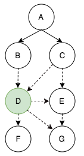
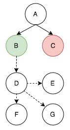
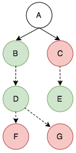
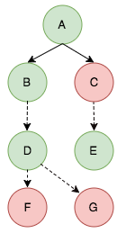

# Potato Protocol v2.1

PROPOSAL

## Terminology

* `client` - An active user running an instance of the Potato application. Each unique user may run only one instance at a time.
* `mesh` - The full population of interconnected clients.
* `peer` - A client that has a direct WebRTC connection to another client without having to go through a third client.
* `message` - A WebRTC data transmission that adheres to the specified Message Schema.
* `frame` - A representation of the visual contents of a specific client's Potato canvas at a specific point in time.

## Mesh Conditions


Under ideal conditions, the mesh will consist of clients which are all peers (directly connected to each other), shown on the left. Connections between non-A clients are not depicted.

Communication under this condition is straight-forward as any peer can transmit to its peers and reach all the clients in the mesh.

However, due to network conditions, some clients may disconnect from each other while retaining connections to other peers. As a result, it is possible that some clients are still part of the overall mesh by maintaining at least one direct connection, but are not direct peers with all clients. This is shown on the right.

Communication under this condition is less straight-forward as transmitting to each peer does not guarantee that data will reach all clients in the mesh. Furthermore, clients do not know who all the clients in the mesh are.

Potato Protocol 2.1 aims to facilitate communication between all clients, even in this second condition.

Note: In some cases, a client may lose connection with _all_ its peers. At this point, we will consider the client to no longer be part of the mesh as it is no longer reachable.

## Messages

A **message** is a general transmission that is sent over WebRTC from one client to a directly-connected peer. To reach the full mesh population, data in a message may need to be relayed through multiple clients.

### Schema
Messages must adhere to the following schema:

```
{
    "type": STRING [REQUIRED],
    "identifier": STRING [REQUIRED],
    "from": STRING [REQUIRED],
    "to": STRING [OPTIONAL],
    "visited": ARRAY OF STRINGS [REQUIRED],
    "body": JSON-SERIALIZABLE OBJECT [OPTIONAL]
}
```

* `type` - Indicates the message's purpose. It must be one of the following strings:
	* `direct` - A direct message from one client to another.
	* `broadcast` - A message intended for all clients in the mesh.
	* `direct_election_request` - A message indicating the start of a direct election.
	* `direct_election_response` - A message containing an individual client's vote in a direct election.
	* `indirect_election_request` - A message indicating the start of an indirect election.
	* `indirect_election_response` - A message containing an individual client's vote in an indirect election.
* `identifier` - A string identifier that is unique to the message (but it should remain constant as the message is relayed through the mesh).
* `from` - The string name of the client that originally created the message.
* `to` - The string name of the client that the message should be delivered to.
* `visited` - An array of client string names that the message has been relayed through already.
* `body` - A JSON-serializable object that contains the message's content.

#### Direct Messages
**Direct messages** (`type` of `direct`) should be ignored (other than any parsing/processing required to relay for delivery to the destination) by any other client not specified in the `to` field. Direct messages **must** include a `to` field.

During initial transmission from the originating client, the originating client should check if any of its peers is the recipient client. If so, it should transmit the message solely to that peer.

If the recipient client is not a direct peer of the originating client, the originating client should add its name to the `visited` array and transmit the message to all of its peers. The originating client should also log the message `identifier` in a local message cache.

Each peer should repeat the above process by determining if the recipient is a peer. If so, directly transmit solely to the peer. Otherwise, add its name to the `visited` array and transmit to all peers, excluding any peers whose names are already in the `visited` array. The client should also log the message `identifier` to its local message cache; if the client receives another message with the same `identifier` later on, it may ignore it completely.

To prevent unnecessarily large message caches, each client may clear its cache after 5 seconds of not receiving any messages.

This process should continue until the message reaches its recipient client or all connected clients in the mesh have touched the message (the message is undeliverable in this case).

#### Broadcast Messages

A **broadcast message** (`type` of `broadcast`) should be parsed by every client in the mesh, then relayed on to other clients to ensure that the full population receives the message.

The originating client should append its name to the `visited` array and transmit the message to all of its direct peers. The originating client should then add the message `identifier` to its local message cache.

Each of the receiving peers should add the message `identifier` to its local message cache and parse the message's body with the relevant application logic.

Each peer should then add its name to the `visited` array and transmit the message to all of its peers whose names do not appear in the `visited` array.

If a client receives a message with an `identifier` that already appears in its local message cache, it should discard the message and **not** relay it, as this would cause a loop.

Eventually, the message will reach all connected clients by reaching clients with either no peers or whose peers have already received the message.

##### Avoiding Loops


By checking against a combination of the `visited` array and local message caches, we can avoid broadcast loops. In the above diagram, client E has clients D and G as peers. If client A broadcasts a message and no checks are performed, client E will receive the same message from clients C and D. It will then transmit the message to G, which will transmit the message back to D, which creates a loop back to E, G, D, etc.

If E receives the message from C before it receives the message from D, it should add the message `identifier` to its local message cache. When the message from D arrives, it checks the cache and, upon finding a matching identifier, ignores it. The reverse is true if the message from D arrives before C. As a result G will only receive the message once.

When G receives the message, it should see that client E and either C *or* D have already received the message in the `visited` array (this is because C or D originally transmitted the message to E and the second copy was discarded as described previously). If D is in the `visited` array, G will not transmit the message any further as it has no other peers.

If D is *not* in the `visited` array (because E received its message from C first), G will unknowingly relay the message on to D. At this point, we will rely on D to consult its local message cache and know to discard the message in order to avoid a loop.

Some possible outcomes are shown below (grayed-out dashed lines depict peer connections that are either not transmitted or are discarded via local message cache):


Note that the rightmost outcome is possible due to the network conditions: for example, if network latency delays E's transmission to D so it arrives after G's transmission.

#### Election Messages
Refer to the Elections section for details on the election process.

## Elections
A key requirement of the Potato Protocol is to be able to synchronize canvas frames across all clients in the mesh. The Potato Protocol utilizes an **election process** in which all clients in the mesh vote whether or not to accept a new frame.

The election process may seem similar to blockchains, however there are critical differences:

* No encryption technologies are used (besides standard hashing).
* Only the last "block" is retained.
* The decision whether or not to progress to the next frame is ultimately made the originating client rather than the mesh as a whole (the originating client may choose to ignore the election results).
* Elections do not evaluate whether or not a frame is valid - rather they simply indicate assent by the mesh to allow a specific client to dictate the next frame. Indeed, the contents of the next frame may change between the time an election is requested and the time that all votes are received.

If this election process was applied to a system of government, it would be considered a "weak democracy" at best due to the lack of internal enforcement of election results. However, the author believes that this system will ensure synchronized client state *over time* with minimal overhead, at the expense of synchronized state at *every moment in time*. Given the relative unimportance of the data being transmitted as well as the potential for high frequency changes, increasing overhead to improve state management would appear to be undesirable.

### Direct Elections
When a client (the originating client) desires to update the mesh to its current canvas state, it will initiate an election.

To initiate an election, the client will transmit a message to its directly connected peers with a `type` value of `direct_election_request`.

In the `body` of the message, the client must include the following key-value pairs:

* `parent` - The current frame identifier (string). If no frames have ever been sent before during the mesh's lifetime (this is this first frame), the `parent` value should be hardcoded to `INITIAL`.
* `next` - The string identifier for the next proposed frame. This identifier should be a SHA1 hash of:
	* The client's current system time in Unix milliseconds, rounded to the nearest whole.
	* The client's name (truncated to 100 characters).
	* A random string value.
	* These values should be concatenated together with `-` symbols between them, but not preceding or following, in the above order: `time-name-random`.
* `originator` - The client's name.

In an ideal mesh, the originating client would have a direct peer connection to all the clients in the mesh and would be able to simply wait for their votes and complete the election. However, we need to account for non-ideal conditions in which not all clients are directly connected to each other. To handle this, we need to employ indirect elections.

### Indirect Elections
Because the originating client may not have a direct connection to all clients in the mesh, we cannot rely exclusively on direct elections. This is because the originating client doesn't know *who* all the clients are in the mesh - it only knows about its peers. To maintain synchronicity across the the mesh, we must allow all clients to vote, but without a full client roster, the originator neither knows when all the votes are in nor how to calculate percentages to determine a result.

**Indirect elections** attempt to resolve this issue by way of representative voting. After an originating client sends a direct election request to each of its peers, those peers send a message with a `type` of `indirect_election_request` to each of their peers (excluding the originator).

The message should include the same `body` as the direct election request.

Each of the peers that receive an indirect election request should, in turn, create a new indirect election request to all of its peers, excluding the direct election originator, the peer that sent the current indirect election request, and any peers that have previously sent indirect election requests with the same `parent` and `next` values.



In the above diagram, A is the originating client. It sends direct election requests to B and C. D is a peer of both B and C, but not of A, so both B and C would send indirect election requests to D.

If B's indirect election request arrives at D before C's request does, D would send an indirect election request to all of its peers: C, E, F, and G. It does not send a request to B because B was the party that initiated its own indirect election request with D. D *does* send a request to C because D has no way of knowing that C is already involved in a direct election.

Moments later, C's indirect election request arrives at D. D should check the `parent` and `next` values to determine that this is the same pairing as B's request. The client should respond with an abstain vote.

E is a peer of both C and E, so it is possible E will receive multiple indirect election requests. When a client receives multiple indirect election requests with the same `parent` and `next` values, it should respond to only the first request and abstain from the subsequent ones.

### Election Request Logic

* An originating client that wants to make a change sends direct election requests to all of its direct peers.
* Any client that receives a direct election request sends indirect election requests to all of its peers, excluding the originating client.
* Any client that receives an indirect election request sends its own indirect election request to all of its peers except:
	* If a peer is also the originating client, they do not receive an indirect election request.
	* If a peer is the party that sent the client its indirect election request, it does not receive a request.
* If a client receives an indirect election request from a peer that the client has already sent a request with an identical `parent` and `next` value to, the client should respond with an ABSTAIN.
* If a client receives multiple indirect election requests with the same `parent` and `next` values, it should respond with ABSTAIN to all requests except for the first one.
	* However, if a client receives both a direct election request and an indirect election request with the same `parent` and `next` values, the client can respond to both the direct election request and the *first* indirect election request.


### Election Voting Logic
A client should vote according the following criteria:

* YES if the `parent` hash matches the client's current frame identifier.
* NO if the `parent` hash does not match the client's current frame identifier
* NO if the `parent` hash matches the client's current frame identifier, but it has **already voted** for a different `next` hash with the same `parent` identifier.

If a client has sent indirect election requests itself, it must wait either 300ms or for all the peers to respond with votes/abstains. It should tally all the votes with a weight of 1 vote per non-abstain. It should then add its own vote to the tally with a weight of 1.5. If there are more votes for YES, then YES wins. If there are more votes for NO, then NO wins.

Clients get a 1.5 vote weighting in their own elections to avoid any possibility of ties. For example, consider a situation where there are 3 peers, two of which respond with NO and one with YES. If the client votes YES, it creates a tie. But with a weighting of 1.5, it becomes 2 NO, 2.5 YES. While this may be somewhat arbitrary and unfair, it avoids the ambiguity of ties.

If a client did not send any indirect election requests, it can determine YES or NO solely using the logic in the above list.

A single YES or NO value should then be passed up to the parent client that sent the original election request.

#### Direct Election-Specific Logic

In direct elections, the originating client's vote weight remains 1.5, however it must always vote YES for itself.

If an originating client receives a direct or indirect election request for a *different* `next` value than its own proposal, it must always vote NO.

### Abstaining
When a client receives an abstaining vote, it should exclude the count of those abstaining peers from the total (10 requests go out, 6 vote YES, 2 vote NO, 2 abstained - YES wins with 75% of the vote).

### Election Duration
An indirect election **must** terminate within 300ms. If there are peers who have not responded after 300ms of the request, those peers are considered to have abstained.

There is **no** time limit on direct elections. However, no client can request more than one direct election at a time. If the originating client's desired changes update while an election is ongoing, it does not need to do anything - if it wins the election, it can simply broadcast the most up-to-date frame.

### Indirect and Direct Election Response

When a client responds to an election request, it should use a message `type` of either `indirect_election_response` or `direct_election_response`, depending on the initial request type.

Its `body` should contain a `vote` key with `YES`, `NO`, or `ABSTAIN` as string values, as well as the original `parent` and `next` key-values.

### Example


Consider the above situation: A is the originating client, it sends direct election requests to B and C.

C, D, E, and G all have multiple peers, so they will both receive indirect election requests as well as make their own indirect election requests.

F has only one peer, which is not the originating client, so it will only receive indirect election requests.


Let us assume that D receives its indirect election request from B before it receives anything from C, E, or G. It will send indirect election requests to C, E, F, and G.

Moments later, D receives its request from C with the same `parent` and `next` values that D has already received. Because D has already sent its own request to C and because D has already seen a request with these values, D should respond that it will abstain from C's request.



A similar thing will happen with E: if it receives D's request before C, it should respond to C that it is abstaining. If it receives C's request first, it should abstain from D.

Let's say E gets C's request first. The current state of the election is:

| Client | Responses | Outcome |
| --- | --- | --- |
| B | D: Pending | Pending |
| C | D: ABSTAIN, E: Pending | Pending |
| D | C: Pending, E: Pending, F: Pending, G: Pending | Pending |

Since F does not have any peers it can send a request to, F can determine its vote using pure logic. Let's say it votes NO.


The new state is:

| Client | Responses | Outcome |
| --- | --- | --- | 
| B | D: Pending | Pending |
| C | D: ABSTAIN, E: Pending | Pending |
| D | C: Pending, E: Pending, F: NO, G: Pending | Pending |

When E receives a request from C, it has two peers it can send requests to: D and G. There is a moment in time for E before it receives D's request (which it will abstain from). During this time, E will send D its own request (since D is a peer E hasn't heard from yet).

| Client | Responses | Outcome |
| --- | --- | --- |
| B | D: Pending | Pending |
| C | D: ABSTAIN, E: Pending | Pending |
| D | C: Pending, E: Pending, F: NO, G: Pending | Pending |
| E | D: Pending, G: Pending | Pending |

We can potentially run into a loop here, where both D and E simultaneously send requests to each other.

If D receives E's request before D has sent its own request, D should not send any requests to E:

| Client | Responses | Outcome |
| --- | --- | --- |
| B | D: Pending | Pending |
| C | D: ABSTAIN, E: Pending | Pending |
| D | C: Pending, F: NO, G: Pending | Pending |
| E | D: Pending, G: Pending | Pending |

If D receives E's request after D has sent its own request to E, D should respond with an ABSTAIN (let's say this is what happens):

| Client | Responses | Outcome |
| --- | --- | --- |
| B | D: Pending | Pending |
| C | D: ABSTAIN, E: Pending | Pending |
| D | C: Pending, E: Pending, F: NO, G: Pending | Pending |
| E | D: ABSTAIN, G: Pending | Pending |

E should also respond with an ABSTAIN to D, because D's `parent` and `next` values are identical to C's request.

| Client | Responses | Outcome |
| --- | --- | --- |
| B | D: Pending | Pending |
| C | D: ABSTAIN, E: Pending | Pending |
| D | C: Pending, E: ABSTAIN, F: NO, G: Pending | Pending |
| E | D: ABSTAIN, G: Pending | Pending |


The current diagram looks as such:


* F has responded with NO.
* E is no longer expecting a response from D (because D has responded with an ABSTAIN)
* C is no longer expecting a response from D (because D has responded with an ABSTAIN)
* D is no longer expecting a response from E (because E has responded with an ABSTAIN)

G will also receive two requests: one from D and one from E. If G receives E's request before D's request, G will send its own request to D, who will respond to G with an ABSTAIN.

If G receives D's request before E, it will send a request to E, who should ABSTAIN from G. Let's say this is what happens. Once E abstains from G's request, G has no more peers to send requests to, so it can internally evaluate its voting logic.

Assume that G receives D's request before E. Let's also say G internally votes YES.


Since G has abstained from E, E has no more peers it is waiting on (both D and G have abstained and C is its originator). As such, it can evaluate its voting logic internally. Let's say it votes YES.



The current state is:

| Client | Responses | Outcome |
| --- | --- | --- |
| B | D: Pending | Pending |
| C | D: ABSTAIN, E: Pending | Pending |
| D | C: Pending, E: ABSTAIN, F: NO, G: YES | Pending |
| E | D: ABSTAIN, G: ABSTAIN, Internal: YES | YES (1.5-0) |

With E having made a decision, it can pass this vote up to C's open request.

For C, its only open request is in E, which has responded with a YES. C should now use its internal logic to determine its own vote (let's say it votes NO). With 1 vote from E for YES, and 1.5 votes (the client gets a weight of 1.5) for NO, there are more NO votes, so C votes NO.



| Client | Responses | Outcome |
| --- | --- | --- |
| B | D: Pending | Pending |
| C | D: ABSTAIN, E: YES, Internal: NO| NO (1-1.5)|
| D | C: NO, E: ABSTAIN, F: NO, G: YES | Pending |
| E | D: ABSTAIN, G: ABSTAIN, Internal: YES | YES (1.5-0) |

At this point, C can respond to D with its vote of NO. D has 1 vote for YES (G) and 2 votes for NO (C, F). D will now run its internal logic to determine how it wants to vote - YES. Since D's internal logic gets a weight of 1.5, it is 2.5 votes for YES, 2 to NO, so YES wins in D.


| Client | Responses | Outcome |
| --- | --- | --- |
| B | D: Pending | Pending |
| C | D: ABSTAIN, E: YES, Internal: NO| NO (1-1.5) |
| D | C: NO, E: ABSTAIN, F: NO, G: YES, Internal: YES | YES (2.5-2) |
| E | D: ABSTAIN, G: ABSTAIN, Internal: YES | YES (1.5-0)|

Now that D has declared for YES, it can respond to B. B perform its own internal logic and also votes for YES - with 2.5 votes for YES and 0 for NO, B declares for YES.


| Client | Responses | Outcome |
| --- | --- | --- |
| B | D: YES, Internal: YES | YES (2.5-0) |
| C | D: ABSTAIN, E: YES, Internal: NO| NO (1-1.5) |
| D | C: NO, E: ABSTAIN, F: NO, G: YES, Internal: YES | YES (2.5-2) |
| E | D: ABSTAIN, G: ABSTAIN, Internal: YES | YES (1.5-0)|

Finally, the direct election can be voted on. B will vote for YES while C will vote for NO.

Because this is a direct election, the originator (A) must vote for itself with a weight of 1.5, so YES wins with 2.5 votes to 1 vote for NO.


* A - YES (1.5 votes)
* B - YES (1 vote)
* C - NO (1 vote)

YES (2.5 votes), NO (1 vote) - YES wins

### Election Outcomes
If a client wins a direct election with a YES vote, it may broadcast its latest frame to all the clients in the mesh.

When a frame broadcast occurs, **all active elections must terminate without resolution**. All clients, regardless of how they voted, must accept the broadcast frame and update their current frame identifier to the new frame.

### Conclusion
With this combination of direct and indirect elections, clients in the mesh are able to reach a consensus without direct connections with each other or even being aware of the full mesh population.